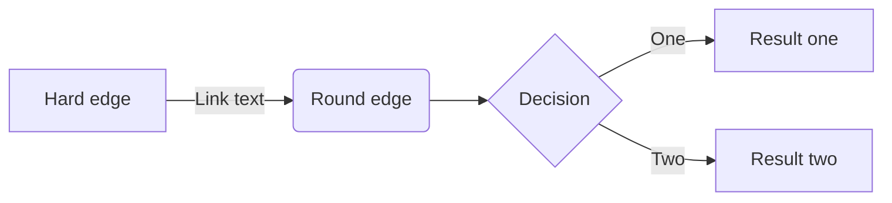
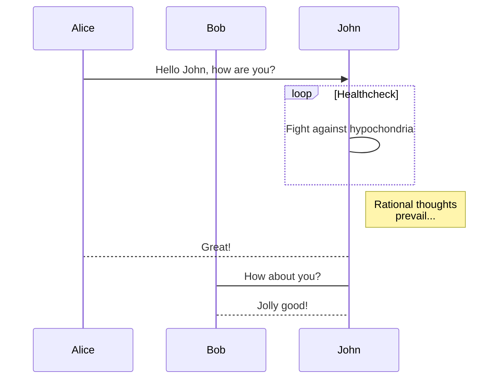
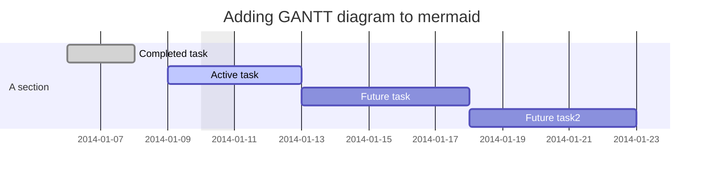
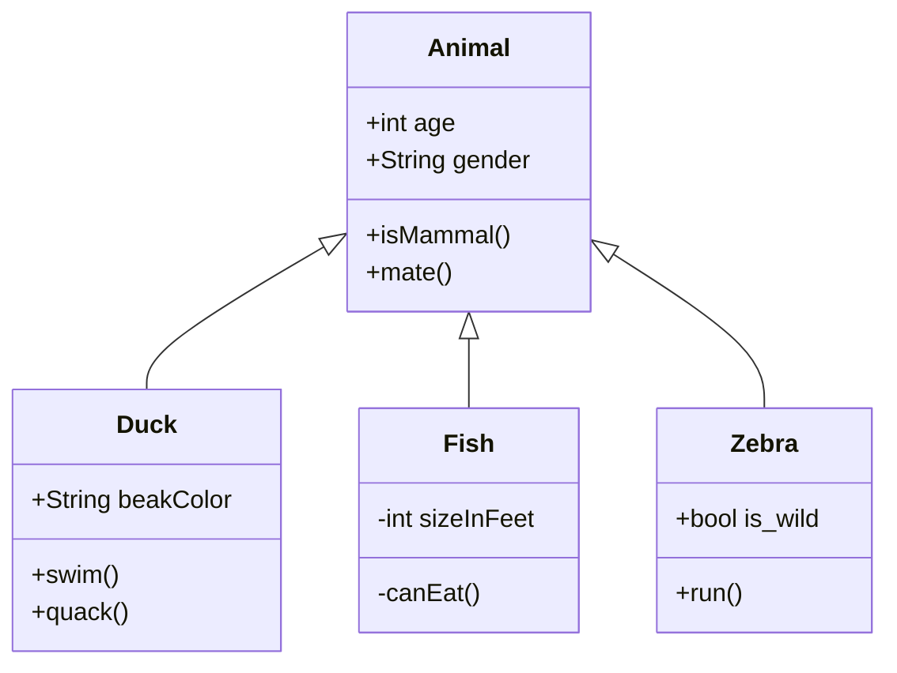
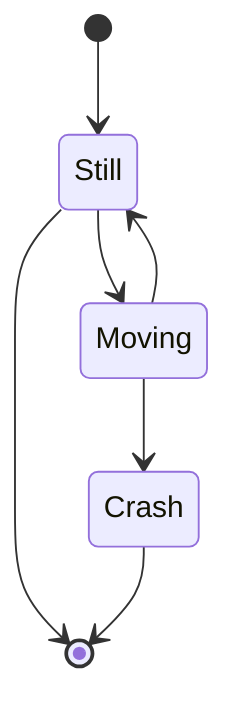
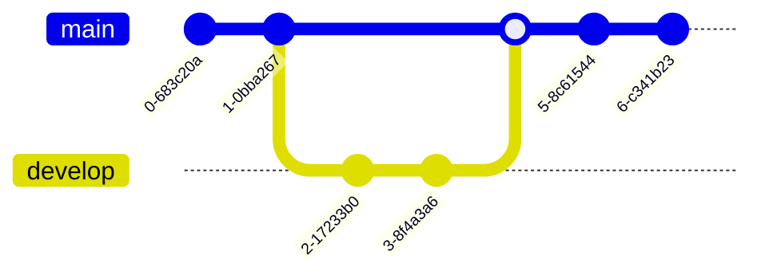
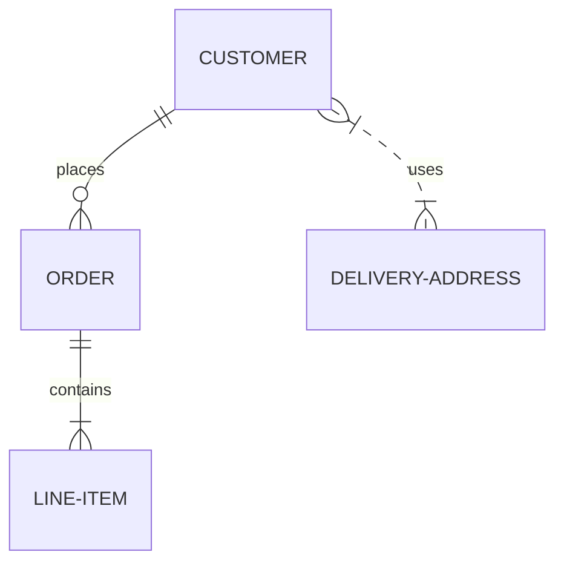
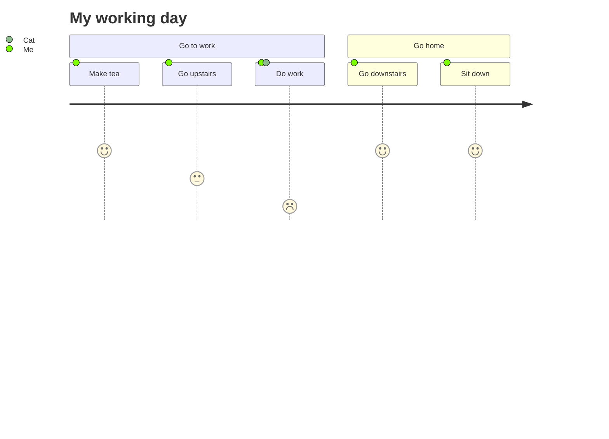
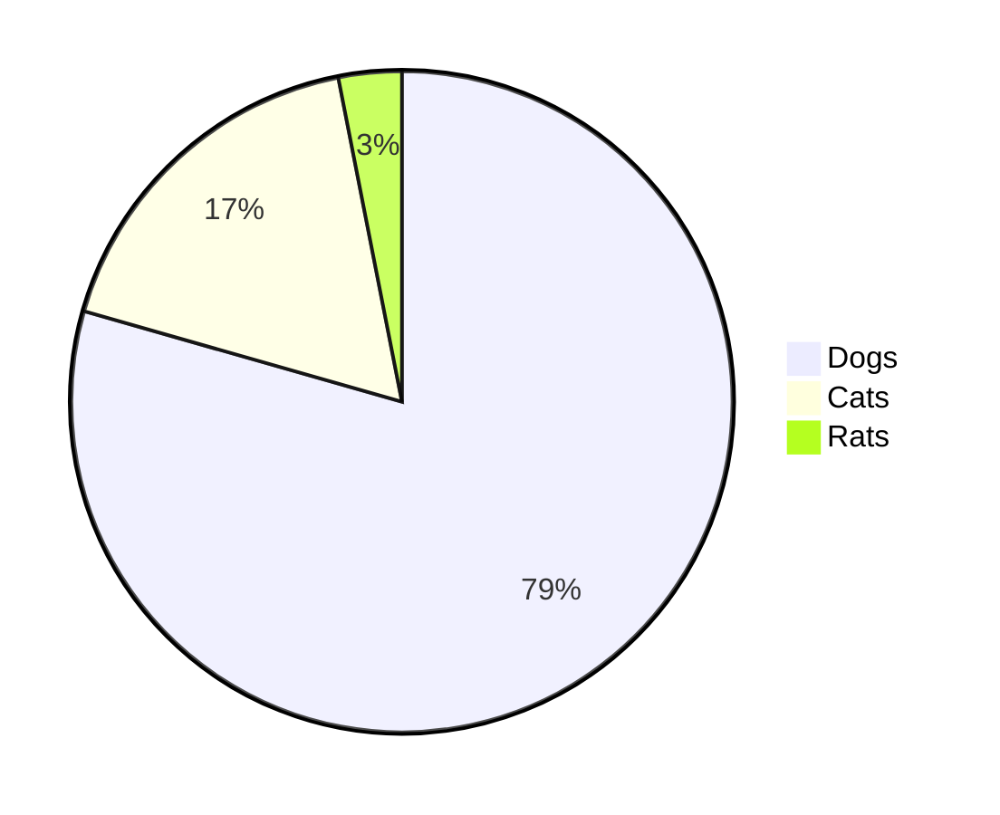
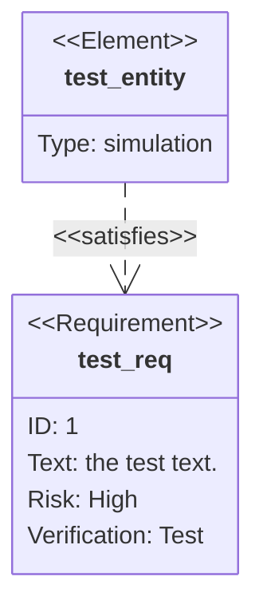

This guide covers essential Markdown syntax and math typesetting for authors using Hugo. It details headings, paragraphs, blockquotes, tables, code blocks, lists, and symbol usage. The document also explains how to embed rich content with Hugo’s shortcodes and create diagrams using Mermaid. Additionally, it outlines how to enable mathematical notation with KaTeX, providing both global and per-page configuration steps.
<!--more-->

### Headings

The following HTML `<h2>`—`<h6>` elements represent five levels of section headings. `<h1>` is for Title. `<h2>` is the highest section level while `<h6>` is the lowest. With `numberedSubtitles` param enabled, items will be numbered


### Paragraph

Xerum, quo qui aut unt expliquam qui dolut labo. Aque venitatiusda cum, voluptionse latur sitiae dolessi aut parist aut dollo enim qui voluptate ma dolestendit peritin re plis aut quas inctum laceat est volestemque commosa as cus endigna tectur, offic to cor sequas etum rerum idem sintibus eiur? Quianimin porecus evelectur, cum que nis nust voloribus ratem aut omnimi, sitatur? Quiatem. Nam, omnis sum am facea corem alique molestrunt et eos evelece arcillit ut aut eos eos nus, sin conecerem erum fuga. Ri oditatquam, ad quibus unda veliamenimin cusam et facea ipsamus es exerum sitate dolores editium rerore eost, temped molorro ratiae volorro te reribus dolorer sperchicium faceata tiustia prat.

Itatur? Quiatae cullecum rem ent aut odis in re eossequodi nonsequ idebis ne sapicia is sinveli squiatum, core et que aut hariosam ex eat. Aque venitatiusda cum, voluptionse latur sitiae dolessi aut parist aut dollo enim qui voluptate ma dolestendit peritin re plis aut quas inctum laceat est volestemque commosa as cus endigna tectur, offic to cor sequas etum rerum idem sintibus eiur? Quianimin porecus evelectur, cum que nis nust voloribus ratem aut omnimi, sitatur? Quiatem. Nam, omnis sum am facea corem alique molestrunt et eos evelece arcillit ut aut eos eos nus, sin conecerem erum fuga. Ri oditatquam, ad quibus unda veliamenimin cusam et facea ipsamus es exerum sitate dolores editium rerore eost, temped molorro ratiae volorro te reribus dolorer sperchicium faceata tiustia prat.

### Blockquotes

The blockquote element represents content that is quoted from another source, optionally with a citation which must be within a `footer` or `cite` element, and optionally with in-line changes such as annotations and abbreviations.

Blockquote without attribution

> Tiam, ad mint andaepu dandae nostion secatur sequo quae.
> **Note** that you can use *Markdown syntax* within a blockquote.
> > **Note** that you can put a blockquote inside a blockquote

Blockquote with attribution

> Don't communicate by sharing memory, share memory by communicating.<br>
> — Rob Pike [^1]

[^1]: The above quote is excerpted from Rob Pike's [talk](https://www.youtube.com/watch?v=PAAkCSZUG1c) during Gopherfest, November 18, 2015.

### Tables

Tables aren't part of the core Markdown spec, but Hugo supports them out-of-the-box.

   Name | Age
--------|------
    Bob | 27
  Alice | 23

Inline Markdown within tables

| Italics   | Bold     | Code   | Strikethrough     | Underline            | Highlight              |
| --------  | -------- | ------ | ----------------- | -------------------- | ---------------------- |
| *italics* | **bold** | `code` | ~~strikethrough~~ | <ins>underline</ins> | <mark>highlight</mark> |

### Code Blocks

Code block with backticks

```html
<!doctype html>
<html lang="en">
<head>
  <meta charset="utf-8">
  <title>Example HTML5 Document</title>
</head>
<body>
  <p>Test</p>
</body>
</html>
```

Code block indented with four spaces

    <!doctype html>
    <html lang="en">
    <head>
      <meta charset="utf-8">
      <title>Example HTML5 Document</title>
    </head>
    <body>
      <p>Test</p>
    </body>
    </html>

Code block with Hugo's internal highlight shortcode

<!doctype html>
<html lang="en">
<head>
  <meta charset="utf-8">
  <title>Example HTML5 Document</title>
</head>
<body>
  <p>Test</p>
</body>
</html>


### List Types

Ordered List

1. Item 1
   1. Sub-item 1.1
   2. Sub-item 1.2
   3. Sub-item 1.3
2. Item 2
3. Item 3

Unordered List

- Fruit
  - Apple
  - Orange
  - Banana
- Dairy
  - Milk
  - Cheese

Checklist

- [x] Item 1
- [ ] Item 2
  - [x] Sub-item 2.1
  - [ ] Sub-item 2.2 
- [ ] Item 3 

Definition List

First Term
: This is the definition of the first term.

Second Term
: This is one definition of the second term.
: This is another definition of the second term.

### Symbols

You can use the HTML entity for whatever symbol you want to use. For example, if you want to display the copyright sign (©), you can copy and paste the HTML entity for copyright `(&copy;)` into your Markdown document.

```markdown
Copyright (©) — &copy;
Registered trademark (®) — &reg;
Trademark (™) — &trade;
Euro (€) — &euro;
Left arrow (←) — &larr;
Up arrow (↑) — &uarr;
Right arrow (→) — &rarr;
Down arrow (↓) — &darr;
Degree (°) — &#176;
Pi (π) — &#960;
```

For a complete list of available HTML entities, refer to Wikipedia’s page on [HTML entities](https://en.wikipedia.org/wiki/List_of_XML_and_HTML_character_entity_references).

### Other Elements — abbr, sub, sup, kbd, mark

[This is a comment that will be hidden.]: #

<abbr title="Graphics Interchange Format">GIF</abbr> is a bitmap image format. H<sub>2</sub>O X<sup>n</sup> + Y<sup>n</sup> = Z<sup>n</sup> Press <kbd><kbd>CTRL</kbd>+<kbd>ALT</kbd>+<kbd>Delete</kbd></kbd> to end the session. Most <mark>salamanders</mark> are nocturnal, and hunt for insects, worms, and other small creatures. The [`emojify`](https://gohugo.io/functions/emojify/) function can be called directly in templates or [Inline Shortcodes](https://gohugo.io/templates/shortcode-templates/#inline-shortcodes). To enable emoji globally, set `enableEmoji` to `true` in your site's [configuration](https://gohugo.io/getting-started/configuration/) and then you can type emoji shorthand codes directly in content files; e.g.

<p><span class="nowrap"><span class="emojify">🙈</span> <code>:see_no_evil:</code></span>  <span class="nowrap"><span class="emojify">🙉</span> <code>:hear_no_evil:</code></span>  <span class="nowrap"><span class="emojify">🙊</span> <code>:speak_no_evil:</code></span></p>
<br>

The [Emoji cheat sheet](http://www.emoji-cheat-sheet.com/) is a useful reference for emoji shorthand codes.

---

**N.B.** The above steps enable Unicode Standard emoji characters and sequences in Hugo, however the rendering of these glyphs depends on the browser and the platform. To style the emoji you can either use a third party emoji font or a font stack; e.g.

```css
.emoji {
  font-family: Apple Color Emoji, Segoe UI Emoji, NotoColorEmoji, Segoe UI Symbol, Android Emoji, EmojiSymbols;
}
```

### Math Typesetting

Mathematical notation in a Hugo project can be enabled by using third party JavaScript libraries. In this example we will be using [$\KaTeX$](https://katex.org/)

- Create a partial under `/layouts/partials/math.html`
- Within this partial reference the [Auto-render Extension](https://katex.org/docs/autorender.html) or host these scripts locally.
- Include the partial in your templates like so:

```bash
{{ if or .Params.math .Site.Params.math }}
{{ partial "math.html" . }}
{{ end }}
```

- To enable $\KaTeX$ globally set the parameter `math` to `true` in a project's configuration
- To enable $\KaTeX$ on a per page basis include the parameter `math: true` in content files

**Note:** Use the online reference of [Supported $\TeX$ Functions](https://katex.org/docs/supported.html)

<p>
Inline math: $\varphi = 1+\frac{1}{1+\frac{1}{1+\cdots}}$
</p>

$$
\mathcal L_{\mathcal T}(\vec{\lambda})
= \sum_{(\mathbf{x},\mathbf{s})\in \mathcal T}
    \log P(\mathbf{s}\mid\mathbf{x}) - \sum_{i=1}^m
    \frac{\lambda_i^2}{2\sigma^2}
$$


### Rich Content
Hugo ships with several [Built-in Shortcodes](https://gohugo.io/content-management/shortcodes/#use-hugos-built-in-shortcodes) for rich content, along with a [Privacy Config](https://gohugo.io/about/hugo-and-gdpr/) and a set of Simple Shortcodes that enable static and no-JS versions of various social media embeds.

YouTube Privacy Enhanced Shortcode



<br>


Twitter Simple Shortcode



<br>


Vimeo Simple Shortcode



<br>


Mermaid

Flowchart



Sequence Digram



Gantt



Class Diagram



State Diagram



Git Graph



Entity Relationship Diagram



User Journey



Pie Chart



Requirement Diagram


